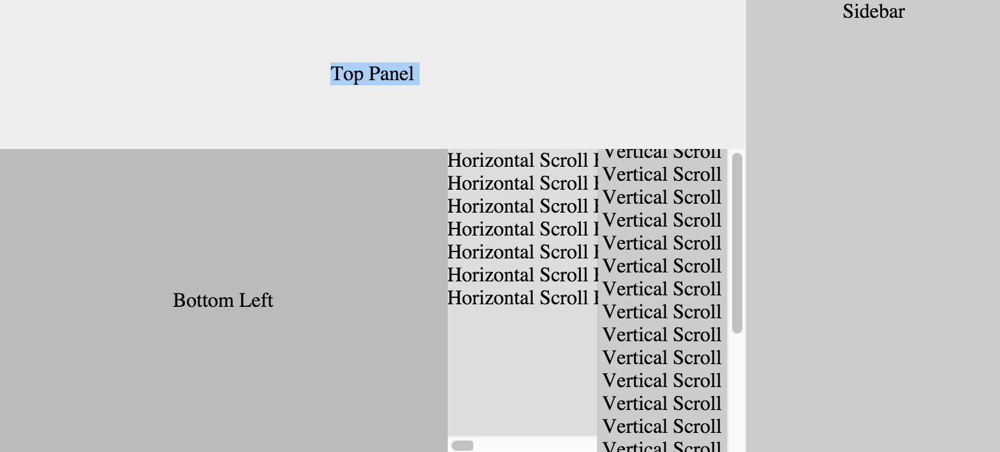

## Flex Layout
A simple layout tool for webpages, only *a single css file*! It uses [flex boxes](https://developer.mozilla.org/en-US/docs/Web/CSS/CSS_Flexible_Box_Layout/Using_CSS_flexible_boxes) to create a dynamic layout that stretches to fit the area you provide it. It can even be used to create full-screen pages, and even handles vertical alignment (!!)

Just add [flex-layout.css](flex-layout.css) or [flex-layout.min.css](flex-layout.min.css) as a stylesheet, and you can use some very simple classes to create complex layouts.

Check out [example.html](example.html) to see what it can do with very little css.

### CSS Classes

CSS Class | What it does
--------- | ------------
`noborder` | Removes padding & margins
`fullscreen` | Add to body to fill screen (horizontally & vertically)
`flex-x` | Layout children horizontally
`flex-y` | Layout children vertically
`fill` | When a child of a `flex-x` or `flex-y` class, it will fill as much space as it can, sharing space equally with other `fill` classes
`scroll-x` | Will horizontally scroll when it overflows
`scroll-y` | Will vertically scroll when it overflows
`center-x` | Center content horizontally
`center-y` | Center content vertically
`center` | Center content horizontally & vertically, equivalent to adding both `center-x` and `center-y`
`bottom` | Content aligns to the bottom
`right` | Content aligns to the right

### Sass ###

If you are a [Sass](http://sass-lang.com/) user (you really should be!), you can add [_flex-layout.scss](_flex-layout.scss) to your project instead. Then, you can just add this line into your main sass file:

    @import "flex-layout"

### Issues & Improvements ###

Please let me know if you use this, and if you can find any improvements! You can contact me at [happytrash@gmail.com](mailto:happytrash@gmail.com), or submit bugs and pull requests here.

This is released under the **MIT License**.
